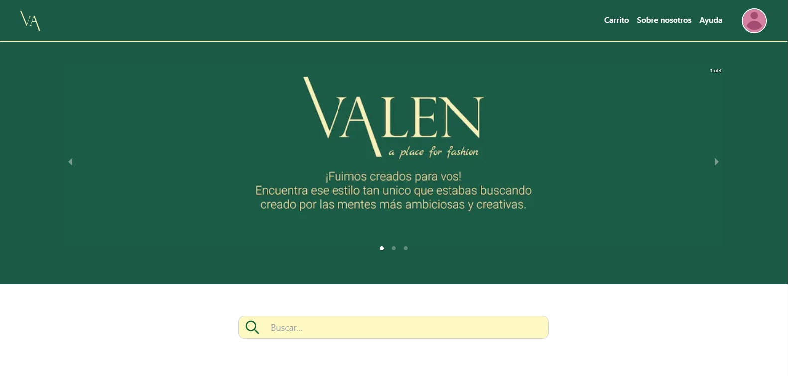

# _E-commerce sobre Diseño de Moda 🥻👗👘_



## _Deploy_

* <a href="https://c8-43-m-mern.vercel.app/">Backend</a>
* <a href="https://valen-c8-43-mern.vercel.app">FrontEnd</a>

## Tecnologías:

```
- Next
- Tailwind
- Node
- Express
- MongoDB
- Mongoose
```

## Descripcion:

Valen es un sitio web destinado a estudiantes, recién graduados y aficionados a la moda, en donde podrás encontrar un espacio simple y eficiente para que puedas mostrar tus maravillosas creaciones al mundo entero o también la oportunidad de tener un guardarropas único y diferente creado por diseñadores exclusivos de nuestra plataforma.
Además, te ofrecemos la posibilidad de tener tu portafolios profesional y también podrás publicar a la venta tus propios diseños con lo cual esperamos que te sirva para ampliar tu experiencia laboral.
Argentina es un país lleno de talente y mucho arte. Nuestro Ecommerce viene a ofrecer un servicio para que el diseño de moda de nuestro país pueda darse a conocer, empezando por argentina misma y traspasando fronteras.

## Integrantes del equipo C8-43-M-MERN

### Backend:

* Braian Aguada

### Frontend:

* Gonzalo Barra
* Ariel Martinez
* Fabian Cruz

### Fullstack :

* Cristian Cacciolatti

### QA :

* Daniela Gerlo

### Diseñador UX/UI :

* Exequiel Robles Vega
* Gerard Vargas


